# Introduction

Association rules are a technique used for knowledge discovery in databases that tries to identify patterns and common sets of items in a transactional database. For instance, e-commerce sites such as Amazon can predict what items you are likely to buy based on what products you have previously bought or browsed.

One particular application of this technique are the anomalous association rules, which detect unusual or novel groups and behaviours in the underlying data. The problem of anomaly detection derives from the assumption that some data does not behave in a similar way as the rest of the population, i.e. having different distributions.
For instance, the distribution of a dataset with an evident outlier component can be analyzed as a mixture of Gaussians that explain the different behaviours and patterns of anomalous data, independently of the rest of the dataset.


```r
set.seed(0)

a <- rnorm(1000, 0, 1)
b <- rnorm(1000, 5, 2)
d <- c(a, b)

df <- c(a, b) %>% 
  data.frame()

ggplot(df) +
  geom_density(aes(x = d, y = ..scaled..)) +
  geom_vline(xintercept = 2.75,
             lty = 'dashed') +
  theme_minimal()
```

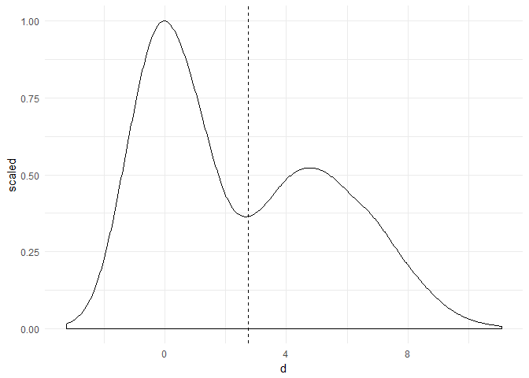<!-- -->

In the graph above it could be argued that data to the right of the dashed line might represent a cluster of outliers.

This project aims to give an overview of both association rules and anomaly detection by analyzing two different datasets

# Association Rules

Consider the recipe book dataset found [here](https://projet.liris.cnrs.fr/ccc/ccc2011/doku.php?id=rules), which comes in XML format but was converted to CSV in an [online converter](http://www.convertcsv.com/xml-to-csv.htm) to ease the data loading process. The separator used for this data is the "|" character, which allows for the consideration of commas and semi-colons in the recipe data.

The application of association rules might help us get an insight on the recipes found inside the book, by detecting common and interesting ingredient patterns.

Let us start by loading the data into memory using the transactional format:


```r
rcp <- read.transactions("./data/RECIPE.csv", sep = "|", quote = "")
```

With the Equivalence Class Transformation (*ECLAT*) algorithm we can find frequent combinations of items in the same transactions. We will set a rather low support value so the algorithm finds many common sets that we can study:


```r
freq_sets <- rcp %>% 
  eclat(parameter = list(support = .001),
        control = list(verbose = FALSE))
```

Let us inspect these itemsets and see how they are distributed.


```r
idx_item <-  freq_sets %>% 
  items() %>% 
  size()

idx_item %>% 
  summary()
```

```
##    Min. 1st Qu.  Median    Mean 3rd Qu.    Max. 
##    1.00    1.00    2.00    1.66    2.00    5.00
```

There are itemsets of sizes ranging from 1 to 5, with an average size of 1.66. There are many sets containing only one item, so let us have another detailed look at those. We will calculate the support metric of these sets 


```r
sgl_item <- freq_sets[idx_item == 1]
sgl_item
```

```
## set of 1103 itemsets
```

```r
sgl_support <- quality(sgl_item)$support

names(sgl_support) <- 
  sgl_item %>% 
  items() %>% 
  arules::LIST(decode = FALSE)

sgl_support %>% 
  arules::head(n = 10)
```

```
##       3053       4252       5045       3088       1530        241 
## 0.09335124 0.08865010 0.05439893 0.04499664 0.04633983 0.03760913 
##      11764       1584       5468       3833 
## 0.03022163 0.02753526 0.03022163 0.03089322
```

The support of the single item sets is significantly low, with only 3 of them having values greater than 0.05.

Let us find some association rules by induction, which can be done using the frequent itemset found in the previous section:


```r
ind_rules <- freq_sets %>% 
  ruleInduction(confidence = .25)
```

We can compute some of the interest measures of these rules, such as support, lift or confidence, among others. To recall what these mean:

*Support is the percentage of transactions in the the dataset that contain both the antecedent and the consequent of the rules.  

*Confidence is the percentage of transactions containing the antecedent, that also contain the consequent. That is, the __conditional probability__ of finding the consequent given that the antecedent is already in the transaction.  

*Lift measures the performance of the rule at predicting a given class, compared against a random choice model. This is measure is simply the ratio of the target response divided by the average response.  


```r
interestMeasure(ind_rules,
                c("support", "chiSquared", "confidence", "conviction", 
                  "coverage", "leverage", "lift"),
                rcp) %>% 
  head(n = 5)
```

```
##       support chiSquared confidence conviction    coverage    leverage
## 1 0.001343183   41.21478          1         NA 0.001343183 0.001280940
## 2 0.001343183   64.26410          1         NA 0.001343183 0.001302590
## 3 0.001343183  154.94496          1         NA 0.001343183 0.001326044
## 4 0.001343183  122.24753          1         NA 0.001343183 0.001321534
## 5 0.001343183   41.21478          1         NA 0.001343183 0.001280940
##       lift
## 1 21.57971
## 2 33.08889
## 3 78.36842
## 4 62.04167
## 5 21.57971
```

Let us plot these rules to allow for an easier visualization of the many associations found in the data:


```r
plot(ind_rules)
```

```
## To reduce overplotting, jitter is added! Use jitter = 0 to prevent jitter.
```

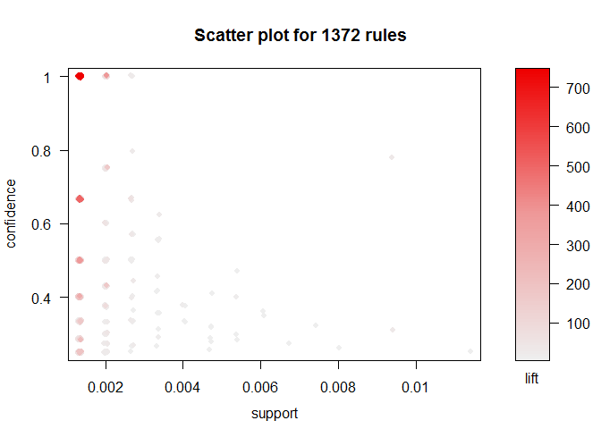<!-- -->

```r
plot(ind_rules,
     method = "graph",
     cex = 0.5)
```

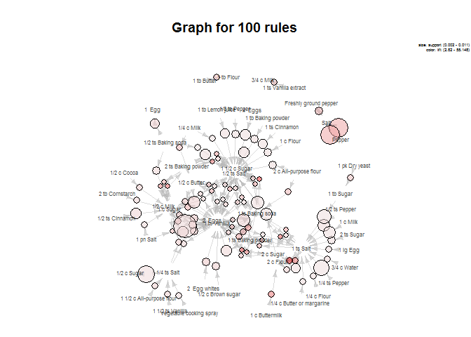<!-- -->

Although somewhat hard to visualize due to the size of the itemset labels, some relationships can be found, such as between soy sauce and scallions or olives and mushrooms.
However, the graph can be a little easier to understand: many instances appear where salt and pepper are coupled together, as well as big interrelated cluster with ingredients such as sugar, eggs, flour, baking powder and vanilla, which are probably recipes for dessert.

Therefore, let us run the apriori algorithm in the dataset and see what the results are. They should be very similar since the defined confidence parameter is the same for both methods.


```r
rcp_rules <- apriori(rcp,
                     parameter = list(support = .001,
                                      confidence = 0.25,
                                      minlen = 2)
                      )
```

```
## Apriori
## 
## Parameter specification:
##  confidence minval smax arem  aval originalSupport maxtime support minlen
##        0.25    0.1    1 none FALSE            TRUE       5   0.001      2
##  maxlen target   ext
##      10  rules FALSE
## 
## Algorithmic control:
##  filter tree heap memopt load sort verbose
##     0.1 TRUE TRUE  FALSE TRUE    2    TRUE
## 
## Absolute minimum support count: 1 
## 
## set item appearances ...[0 item(s)] done [0.00s].
## set transactions ...[12514 item(s), 1489 transaction(s)] done [0.00s].
## sorting and recoding items ... [1103 item(s)] done [0.00s].
## creating transaction tree ... done [0.00s].
## checking subsets of size 1 2 3 4 5 done [0.01s].
## writing ... [1372 rule(s)] done [0.00s].
## creating S4 object  ... done [0.00s].
```

```r
rcp_rules %>% 
  head(n = 100) %>% 
  plot(method = "graph", 
       cex = 0.5)
```

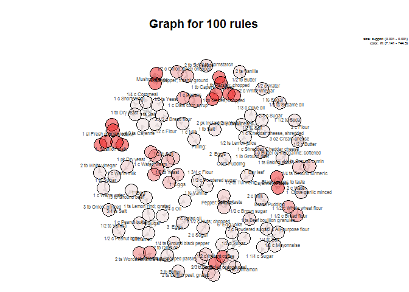<!-- -->

As expected, the graph turns out to be very close to the previous one. We can sort the rules by their lift measure and inspect the more relevant ones:


```r
rcp_ranked <- 
  rcp_rules %>% 
  sort(by = "lift")

rcp_ranked %>%
  head(n = 15) %>% 
  inspect()
```

```
##      lhs                           rhs                        support    
## [1]  {1/2 ts Dried orange peel} => {1/2 c Instant coffee}     0.001343183
## [2]  {1/2 c Instant coffee}     => {1/2 ts Dried orange peel} 0.001343183
## [3]  {4 tb Soy sauce}           => {1 sl Fresh ginger root}   0.001343183
## [4]  {1 sl Fresh ginger root}   => {4 tb Soy sauce}           0.001343183
## [5]  {4 tb Soy sauce}           => {1  Scallion stalk}        0.001343183
## [6]  {1  Scallion stalk}        => {4 tb Soy sauce}           0.001343183
## [7]  {1 sl Fresh ginger root}   => {1  Scallion stalk}        0.001343183
## [8]  {1  Scallion stalk}        => {1 sl Fresh ginger root}   0.001343183
## [9]  {1 tb Chives; chopped}     => {1 tb Capers; chopped}     0.001343183
## [10] {1 tb Capers; chopped}     => {1 tb Chives; chopped}     0.001343183
## [11] {1 tb Chives; chopped}     => {1 tb Parsley; chopped}    0.001343183
## [12] {1 tb Parsley; chopped}    => {1 tb Chives; chopped}     0.001343183
## [13] {1 tb Capers; chopped}     => {1 tb Parsley; chopped}    0.001343183
## [14] {1 tb Parsley; chopped}    => {1 tb Capers; chopped}     0.001343183
## [15] {Black pepper; to taste}   => {Cayenne; to taste}        0.001343183
##      confidence lift  count
## [1]  1          744.5 2    
## [2]  1          744.5 2    
## [3]  1          744.5 2    
## [4]  1          744.5 2    
## [5]  1          744.5 2    
## [6]  1          744.5 2    
## [7]  1          744.5 2    
## [8]  1          744.5 2    
## [9]  1          744.5 2    
## [10] 1          744.5 2    
## [11] 1          744.5 2    
## [12] 1          744.5 2    
## [13] 1          744.5 2    
## [14] 1          744.5 2    
## [15] 1          744.5 2
```

From this top 15 rules, there are some quick insights that can be extracted:

*Soy sauce, scallions and ginger are usually cooked together. We will come back to this later.  

*Capers, chives and parsley also combine quite often, which are savory ingredients used to spice up a recipe.  

*Black and cayenne pepper also pair quite nicely, as would be expected.  


Let us inspect some rules for specific items, by filtering them with the ```arules::subset()``` function. This returns only rules that containg the specific ingredient either in the right or left hand side.
For starters, let us pick analyze recipes that use salt:


```r
rcp_rules %>% 
  subset(items %in% "1/2 ts Salt") %>%
  head(n = 10) %>% 
  inspect()
```

```
##      lhs                               rhs           support    
## [1]  {1/2 ts Lemon juice}           => {1/2 ts Salt} 0.001343183
## [2]  {1/3 c Olive oil}              => {1/2 ts Salt} 0.001343183
## [3]  {1 2/3 c Sugar}                => {1/2 ts Salt} 0.001343183
## [4]  {1 c Cheddar cheese, shredded} => {1/2 ts Salt} 0.001343183
## [5]  {1/2 c Butter; melted}         => {1/2 ts Salt} 0.001343183
## [6]  {2 tb Unsalted butter; melted} => {1/2 ts Salt} 0.001343183
## [7]  {1 c Sifted flour}             => {1/2 ts Salt} 0.001343183
## [8]  {3/4 c Cornmeal}               => {1/2 ts Salt} 0.001343183
## [9]  {2  Hard-cooked eggs; chopped} => {1/2 ts Salt} 0.001343183
## [10] {2 c All purpose flour}        => {1/2 ts Salt} 0.002014775
##      confidence lift      count
## [1]  1.0000000  11.280303 2    
## [2]  1.0000000  11.280303 2    
## [3]  1.0000000  11.280303 2    
## [4]  1.0000000  11.280303 2    
## [5]  0.6666667   7.520202 2    
## [6]  1.0000000  11.280303 2    
## [7]  0.6666667   7.520202 2    
## [8]  0.6666667   7.520202 2    
## [9]  0.6666667   7.520202 2    
## [10] 1.0000000  11.280303 3
```

Salt is a very versatile ingredient that can be used for several types of recipes. For example, we can see that it is commonly used with olive oil, perhaps for salads, as well flour which may be for bread recipes.
Butter is also common, since it is a substitute for cooking oil, and boiled eggs which normally need salt for flavour.

Let us try a different type of ingredient which may be less common, such as instant coffee powder:


```r
rcp_rules %>% 
  subset(items %in% "1/2 c Instant coffee") %>%
  head(n = 10) %>% 
  inspect()
```

```
##      lhs                           rhs                            support confidence      lift count
## [1]  {1/2 ts Dried orange peel} => {1/2 c Instant coffee}     0.001343183       1.00 744.50000     2
## [2]  {1/2 c Instant coffee}     => {1/2 ts Dried orange peel} 0.001343183       1.00 744.50000     2
## [3]  {1/2 c Instant coffee}     => {2/3 c Sugar}              0.001343183       1.00 186.12500     2
## [4]  {2/3 c Sugar}              => {1/2 c Instant coffee}     0.001343183       0.25 186.12500     2
## [5]  {1/2 c Instant coffee}     => {1/2 ts Cinnamon}          0.001343183       1.00  67.68182     2
## [6]  {1/2 c Instant coffee}     => {1/2 c Sugar}              0.001343183       1.00  32.36957     2
## [7]  {1/2 c Instant coffee,                                                                         
##       1/2 ts Dried orange peel} => {2/3 c Sugar}              0.001343183       1.00 186.12500     2
## [8]  {1/2 ts Dried orange peel,                                                                     
##       2/3 c Sugar}              => {1/2 c Instant coffee}     0.001343183       1.00 744.50000     2
## [9]  {1/2 c Instant coffee,                                                                         
##       2/3 c Sugar}              => {1/2 ts Dried orange peel} 0.001343183       1.00 744.50000     2
## [10] {1/2 c Instant coffee,                                                                         
##       1/2 ts Dried orange peel} => {1/2 ts Cinnamon}          0.001343183       1.00  67.68182     2
```

What we can obtain from these first 10 rules is that instant coffee is normally used with sweet ingredients, such orange peel, sugar and cinammon. This might indicate coffee-flavoured desserts, since it is improbable that great coffee recipes use the instant kind.

Now, we will come back to the soy sauce found in earlier analysis and investigate further on the knowledge this can bring. It is expected for this ingredient to return rules that might indicate Asian cuisine, so let us prove that assumption:


```r
rcp_rules %>% 
  subset(items %in% "4 tb Soy sauce") %>%
  head(n = 10) %>% 
  inspect()
```

```
##     lhs                         rhs                          support confidence  lift count
## [1] {4 tb Soy sauce}         => {1 sl Fresh ginger root} 0.001343183          1 744.5     2
## [2] {1 sl Fresh ginger root} => {4 tb Soy sauce}         0.001343183          1 744.5     2
## [3] {4 tb Soy sauce}         => {1  Scallion stalk}      0.001343183          1 744.5     2
## [4] {1  Scallion stalk}      => {4 tb Soy sauce}         0.001343183          1 744.5     2
## [5] {1 sl Fresh ginger root,                                                               
##      4 tb Soy sauce}         => {1  Scallion stalk}      0.001343183          1 744.5     2
## [6] {1  Scallion stalk,                                                                    
##      4 tb Soy sauce}         => {1 sl Fresh ginger root} 0.001343183          1 744.5     2
## [7] {1  Scallion stalk,                                                                    
##      1 sl Fresh ginger root} => {4 tb Soy sauce}         0.001343183          1 744.5     2
```

Just as before, we find that this ingredient is commonly paired with ginger root and scallions, which is a type of onion. These are ingredients usually found in Asian dishes such as *ramen* and *pho*, typical recipes elaborated with rice noodles.

Another interesting item might be cinnamon, which is expected to be used mainly in desserts and sweets:


```r
rcp_rules %>% 
  subset(items %in% "1/2 ts Cinnamon") %>%
  head(n = 10) %>% 
  inspect()
```

```
##      lhs                           rhs                        support confidence       lift count
## [1]  {1/2 ts Dried orange peel} => {1/2 ts Cinnamon}      0.001343183  1.0000000  67.681818     2
## [2]  {1/2 c Instant coffee}     => {1/2 ts Cinnamon}      0.001343183  1.0000000  67.681818     2
## [3]  {1 ts Nutmeg}              => {1/2 ts Cinnamon}      0.001343183  0.3333333  22.560606     2
## [4]  {2/3 c Sugar}              => {1/2 ts Cinnamon}      0.001343183  0.2500000  16.920455     2
## [5]  {1 ts Ground ginger}       => {1/2 ts Cinnamon}      0.001343183  0.3333333  22.560606     2
## [6]  {1/3 c Sugar}              => {1/2 ts Cinnamon}      0.002014775  0.3750000  25.380682     3
## [7]  {1/4 ts Ground cloves}     => {1/2 ts Cinnamon}      0.001343183  0.2857143  19.337662     2
## [8]  {1/2 ts Cinnamon}          => {1 c Sugar}            0.004701142  0.3181818   6.866271     7
## [9]  {1/2 c Instant coffee,                                                                      
##       1/2 ts Dried orange peel} => {1/2 ts Cinnamon}      0.001343183  1.0000000  67.681818     2
## [10] {1/2 ts Cinnamon,                                                                           
##       1/2 ts Dried orange peel} => {1/2 c Instant coffee} 0.001343183  1.0000000 744.500000     2
```

Again, our hypothesis is confirmed: orange peel, ground ginger, sugar and nutmeg are very prevalent in confectionery and the elaboration of sweets.

In this vein, we can try to check for ingredients such as eggs, which can not only be used for cakes and desserts, but also for other types of dish such as omelettes:


```r
rcp_rules %>% 
  subset(items %in% "1  Egg") %>%
  head(n = 20) %>% 
  inspect()
```

```
##      lhs                            rhs      support     confidence
## [1]  {1/3 lb Ground beef}        => {1  Egg} 0.001343183 1.0000000 
## [2]  {1 ts Lemon rind; grated}   => {1  Egg} 0.001343183 1.0000000 
## [3]  {3/4 c Cornmeal}            => {1  Egg} 0.001343183 0.6666667 
## [4]  {1/2 c Molasses}            => {1  Egg} 0.001343183 1.0000000 
## [5]  {2/3 c Milk}                => {1  Egg} 0.001343183 0.6666667 
## [6]  {1/4 ts Vanilla}            => {1  Egg} 0.001343183 0.4000000 
## [7]  {1 c Raisins}               => {1  Egg} 0.001343183 0.4000000 
## [8]  {1  Onion; chopped}         => {1  Egg} 0.001343183 0.4000000 
## [9]  {1 1/4 ts Salt}             => {1  Egg} 0.002014775 0.6000000 
## [10] {1 tb Oil}                  => {1  Egg} 0.001343183 0.3333333 
## [11] {1/2 c Granulated sugar}    => {1  Egg} 0.002014775 0.4285714 
## [12] {2 tb Milk}                 => {1  Egg} 0.001343183 0.2857143 
## [13] {1 1/2 ts Baking powder}    => {1  Egg} 0.001343183 0.2857143 
## [14] {1 pk Yeast}                => {1  Egg} 0.001343183 0.2857143 
## [15] {1 ts Ground ginger}        => {1  Egg} 0.001343183 0.3333333 
## [16] {1  Egg yolk}               => {1  Egg} 0.001343183 0.2500000 
## [17] {1/3 c Sugar}               => {1  Egg} 0.001343183 0.2500000 
## [18] {1 1/2 c All-purpose flour} => {1  Egg} 0.002014775 0.3750000 
## [19] {1 1/2 ts Vanilla}          => {1  Egg} 0.001343183 0.2500000 
## [20] {1 c All-purpose flour}     => {1  Egg} 0.002014775 0.3750000 
##      lift      count
## [1]  26.589286 2    
## [2]  26.589286 2    
## [3]  17.726190 2    
## [4]  26.589286 2    
## [5]  17.726190 2    
## [6]  10.635714 2    
## [7]  10.635714 2    
## [8]  10.635714 2    
## [9]  15.953571 3    
## [10]  8.863095 2    
## [11] 11.395408 3    
## [12]  7.596939 2    
## [13]  7.596939 2    
## [14]  7.596939 2    
## [15]  8.863095 2    
## [16]  6.647321 2    
## [17]  6.647321 2    
## [18]  9.970982 3    
## [19]  6.647321 2    
## [20]  9.970982 3
```

The expected ingredients for cakes and pastries appear in this ruleset: flour, milk, raisins, baking soda, lemon rind, water, yeast, vanilla and molasses (molten sugar) are some examples. However, there are some oddities as well, such as ground beef and onion. It is possible that the egg in this cases is used to dip the other ingredients in batter so that they can be fried.

Another item that can be quite specific are the bay leaves, which is also called *laurel*. It is an aromatic plant that is used in cooking for the distinct flavour and fragrance.


```r
rcp_rules %>% 
  subset(items %in% "1  Bay leaf") %>%
  head(n = 10) %>% 
  inspect()
```

```
##      lhs                            rhs             support     confidence
## [1]  {1/2 ts Turmeric}           => {1  Bay leaf}   0.001343183 1.0000000 
## [2]  {1 tb Tamari}               => {1  Bay leaf}   0.001343183 0.6666667 
## [3]  {3 qt Water}                => {1  Bay leaf}   0.001343183 0.5000000 
## [4]  {1 ts Dried thyme}          => {1  Bay leaf}   0.001343183 0.5000000 
## [5]  {1/4 c Flour}               => {1  Bay leaf}   0.002014775 0.2500000 
## [6]  {1  Bay leaf,2 ts Salt}     => {1/4 ts Pepper} 0.001343183 1.0000000 
## [7]  {1/4 ts Pepper,2 ts Salt}   => {1  Bay leaf}   0.001343183 1.0000000 
## [8]  {1  Bay leaf,1/4 ts Pepper} => {2 ts Salt}     0.001343183 0.6666667 
## [9]  {1  Bay leaf,2 tb Flour}    => {Salt}          0.001343183 0.6666667 
## [10] {2 tb Flour,Salt}           => {1  Bay leaf}   0.001343183 0.6666667 
##      lift     count
## [1]  57.26923 2    
## [2]  38.17949 2    
## [3]  28.63462 2    
## [4]  28.63462 2    
## [5]  14.31731 3    
## [6]  43.79412 2    
## [7]  57.26923 2    
## [8]  55.14815 2    
## [9]  22.05926 2    
## [10] 38.17949 2
```

These leaves appear in conjunction with other types of spices, such as turmeric, tamari, thyme, salt and pepper. Some other ingredients, such as water, indicate that the bay leaf can be used for soups and stews.

While on the topic of aromatic plants and spices, we can also take a look a oregano, which is a common ingredient specially in Italian cuisine:


```r
rcp_rules %>% 
  subset(items %in% "1/2 ts Oregano") %>%
  head(n = 10) %>% 
  inspect()
```

```
##     lhs                        rhs                     support    
## [1] {1 lb Lean ground beef} => {1/2 ts Oregano}        0.001343183
## [2] {1/2 ts Oregano}        => {1 lb Lean ground beef} 0.001343183
## [3] {1/2 ts Cumin}          => {1/2 ts Oregano}        0.001343183
## [4] {1/2 ts Oregano}        => {1/2 ts Cumin}          0.001343183
## [5] {1 c All-purpose flour} => {1/2 ts Oregano}        0.001343183
## [6] {1/2 ts Oregano}        => {1 c All-purpose flour} 0.001343183
##     confidence lift      count
## [1] 0.6666667  124.08333 2    
## [2] 0.2500000  124.08333 2    
## [3] 0.6666667  124.08333 2    
## [4] 0.2500000  124.08333 2    
## [5] 0.2500000   46.53125 2    
## [6] 0.2500000   46.53125 2
```

Again, as expected, oregano is found among cumin, flour, and ground beef, which can very indicative of pizza recipes!

Since we found flour as a prevalent item in the previous ruleset, let us investigate which rules contain this ingredient as well:


```r
rcp_rules %>% 
  subset(items %in% "2 c Flour") %>%
  head(n = 10) %>% 
  inspect()
```

```
##      lhs                               rhs                  support    
## [1]  {1 1/2 ts Soda}                => {2 c Flour}          0.001343183
## [2]  {3 ts Baking powder}           => {2 c Flour}          0.001343183
## [3]  {1 c Buttermilk}               => {2 c Flour}          0.002686367
## [4]  {1  Egg yolk}                  => {2 c Flour}          0.001343183
## [5]  {1/2 c Shortening}             => {2 c Flour}          0.002014775
## [6]  {1 lg Egg}                     => {2 c Flour}          0.002014775
## [7]  {2 c Flour}                    => {1/2 ts Salt}        0.005372733
## [8]  {2 c Flour,3 ts Baking powder} => {1 c Sugar}          0.001343183
## [9]  {1 c Sugar,3 ts Baking powder} => {2 c Flour}          0.001343183
## [10] {1 c Sugar,2 c Flour}          => {3 ts Baking powder} 0.001343183
##      confidence lift       count
## [1]  1.0000000   55.148148 2    
## [2]  0.5000000   27.574074 2    
## [3]  0.6666667   36.765432 4    
## [4]  0.2500000   13.787037 2    
## [5]  0.3750000   20.680556 3    
## [6]  0.2500000   13.787037 3    
## [7]  0.2962963    3.342312 8    
## [8]  1.0000000   21.579710 2    
## [9]  0.6666667   36.765432 2    
## [10] 0.6666667  248.166667 2
```

This ingredient in tipically paired with eggs, baking powder and sugar, as well as shortening which is derived from animal fat. Perhaps, these combinations are pointing towards cakes and confectionery, although the rules containing flour and salt (8 of these are found in the previous ruleset) may be indicative of bread recipes.

Lastly, let us inspect which rules contain chopped onion and see what insights this yields:


```r
rcp_rules %>% 
  subset(items %in% "1/2 c Chopped onion") %>%
  head(n = 10) %>% 
  inspect()
```

```
##     lhs                             rhs                              support confidence      lift count
## [1] {2 tb Chopped fresh parsley} => {1/2 c Chopped onion}        0.001343183  0.2857143 53.178571     2
## [2] {1/2 c Chopped onion}        => {2 tb Chopped fresh parsley} 0.001343183  0.2500000 53.178571     2
## [3] {1/2 c Chopped onion}        => {2 tb Olive oil}             0.001343183  0.2500000 12.408333     2
## [4] {1/2 c Chopped onion}        => {2 tb Butter}                0.002014775  0.3750000 18.012097     3
## [5] {1/2 c Chopped onion}        => {1/2 ts Salt}                0.001343183  0.2500000  2.820076     2
## [6] {1/2 c Chopped onion}        => {1 ts Salt}                  0.001343183  0.2500000  2.678058     2
```

Onions, finely chopped, are normally used in the elaboration of salads. The fact that it is frequently found together with other ingredients such as parsley (another spice), salt and olive oil can give us some idea that this assumption might be headed in the right direction.

In summary, some clear relationships can usually be found, where some items are more tipically paired with sweeter ingredients (for desserts) while others are commonly found around spices, vegetables, or cooking aids such as oil and butter.

# Anomaly Detection

The problem of anomaly detection can be approached from several points of view. A brief summary of these techniques is showcased in this report, which closely follows the theory and scripts found in the class lectures and notes.

Consider the *Wisconsin Breast Cancer Dataset*, which contains several cases of breast tumours with numerical attributes related to its dimensions and properties. A class variable is provided to classify the tumour as benign (B) or malign (M).


```r
library(data.table)
```

```
## 
## Attaching package: 'data.table'
```

```
## The following objects are masked from 'package:dplyr':
## 
##     between, first, last
```

```
## The following object is masked from 'package:purrr':
## 
##     transpose
```

```r
wdbc <- read.csv("./data/wdbc.data.txt", head = FALSE)
dim(wdbc)
```

```
## [1] 569  32
```

The application of principal components has been proven to be very useful for the task of anomaly and outlier detection. In our case, we will use this dimension reduction technique to be able to visualize the data points in a comprehensible way.


```r
wdbc %>% 
  select_if(is.numeric) %>% 
  scale() %>% 
  dist() %>% 
  as.matrix() %>% 
  prcomp -> pcc
```

We can inspect the PCs returned and their scores by looking at its ```x``` matrix, which returns the scaled and centered original data multiplied by the rotation matrix:


```r
pcc$x[, 1:2] %>% 
  head()
```

```
##          PC1        PC2
## 1 -137.24641   4.491606
## 2  -16.79631  28.733963
## 3  -50.69746  46.063613
## 4 -188.64742 -54.228166
## 5  -38.18033  29.273527
## 6  -28.30677  16.758914
```

```r
pcc$rotation[, 1:2] %>%
  head
```

```
##            PC1         PC2
## 1  0.019030354 -0.07702412
## 2 -0.020811395 -0.06424392
## 3  0.002792115 -0.08981259
## 4  0.011048560 -0.04065849
## 5 -0.008588556 -0.06638043
## 6 -0.016611799 -0.04877142
```

Once the data is reduced, we can look at the scatter plot of the two first components to see how they are dispersed in the feature space:


```r
pcc$x[, 1:2] %>% 
  data.table() %>% 
  ggplot(aes(x = PC1, y = PC2)) +
    geom_point(size = 2, colour = "dodger blue", alpha = 0.3) +
    theme_minimal()
```

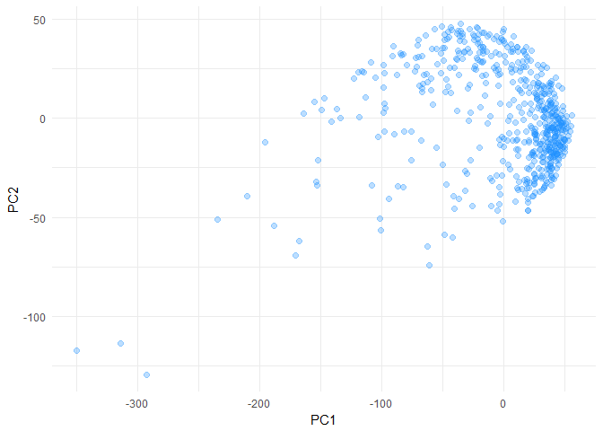<!-- -->


The DBSCAN clustering algorithm is based on the density of the underlying data points, and works by defining to key parameters to detect whether an observation is a *core point* and not an outlier:

*The neighbourhood, or the area to inspect around any given point.
*The minimum number of neighbouring points necessary to classify the observation as _core point_.


```r
library(dbscan)

wdbc %>% 
  select_if(is.numeric) %>% 
  scale() %>% 
  dbscan(eps = 2, minPts = 3) -> db


plotter <- pcc$x[, 1:2] %>% 
  data.table()
  
plotter[, DClusters := db$cluster]

(
  p1 <- plotter %>% 
      ggplot(aes(x = PC1, y = PC2)) +
      geom_jitter(aes(colour = factor(DClusters)),
                   size = 2,
                   alpha = 0.4) +
      labs(colour = "Cluster") +
      theme_minimal()
  )
```

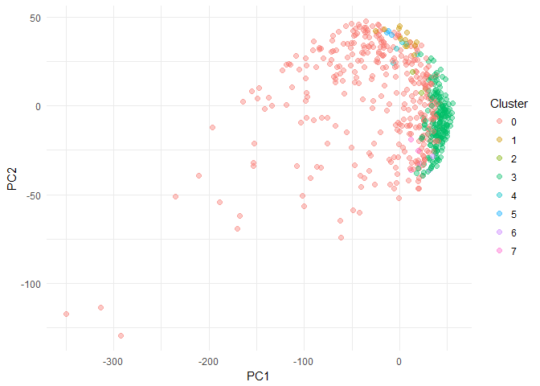<!-- -->

The detected outliers are classified in cluster 0. There is an obvious group of data points that are severely skewed towards the left hand side of the graph, and it's easy to accept that these observations might be anomalous. However, there is some overlap as we move closer to the centroi of data and the right side of the plot. 

## Expectation Maximization

The Expectation Maximization method is an unsupervised clustering algorithm that aims to find similar subspaced on the orientation and variance of the data points.


```r
library(mclust)
```

```
## Package 'mclust' version 5.4
## Type 'citation("mclust")' for citing this R package in publications.
```

```
## 
## Attaching package: 'mclust'
```

```
## The following object is masked from 'package:purrr':
## 
##     map
```

```r
wdbc_em <- wdbc %>%
  select_if(is.numeric) %>%
  scale() %>%
  Mclust(G = 4)
```

We can also plot these results to allow for easier understanding:


```r
plotter[, EMClusters := wdbc_em$classification]

(
  p2 <- ggplot(plotter, aes(x = PC1, y = PC2)) +
        geom_point(aes(colour = factor(EMClusters)),
                   size = 2,
                   alpha = 0.4) +
        theme_minimal() +
    labs(colour = "Cluster")
  )
```

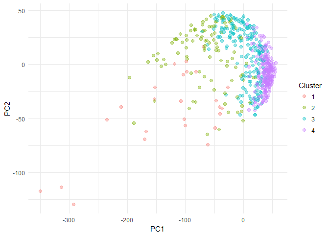<!-- -->

In this case, the outlier cluster is number 1. We can see that this algorithm is much more restrictive and categorises and much lower amount of observations as anomalous points, however their results are fairly similar in classifying the more extreme values.

## Local Outlier Factor

The Local Outlier Factor (LOF) algorithm is used to identify density-based local outliers. In this method, the local density of a data point is compared to that of its neighbours. If the former is significantly lower than the latter, the point is in a sparser region than its neighbours, thus suggesting it is an outlier.
Let us apply the LOF method with a number of neighbours *k = 5*:


```r
library(DMwR)
```

```
## Loading required package: lattice
```

```
## 
## Attaching package: 'DMwR'
```

```
## The following object is masked from 'package:dbscan':
## 
##     kNN
```

```r
plotter <- data.table(pcc$x[, 1:2])


outlier_sc <- lofactor(plotter[, 1:2],
                       k = 5)

outlier_sc %>% 
  density() %>% 
  plot()
```

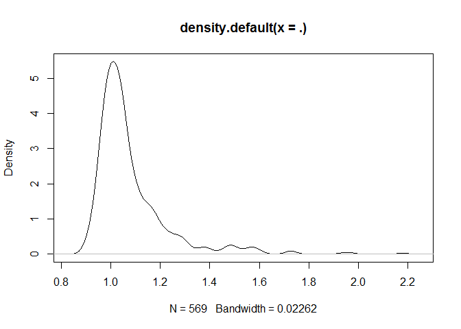<!-- -->

```r
outlier <- outlier_sc %>% 
  order(decreasing = TRUE) %>% 
  head()
```

The density plot above shows a few regions with anomalous density values which may contain some outliers within.

We can also use percentiles to choose the threshold for outlying data points:


```r
outlier_sc %>% 
  quantile()
```

```
##        0%       25%       50%       75%      100% 
## 0.8955936 0.9911471 1.0360793 1.1109329 2.1779943
```

For example, we can take the upper threshold of 95% of the values and visualize them in the plot:


```r
thresh <- outlier_sc %>% 
  quantile(0.95)


(q95_outlier <- which(outlier_sc >= thresh))
```

```
##  [1]   6  31  80  89 109 111 139 140 153 172 179 193 198 201 205 213 215
## [18] 264 285 292 306 315 350 389 408 462 524 529 546
```

```r
lof_outlier <- ifelse(outlier_sc >= thresh,
                      0, 1)


plotter[, LOF := lof_outlier]

(
  p3 <- ggplot(plotter, aes(x = PC1, y = PC2)) +
      geom_point(aes(colour = factor(LOF)),
                 size = 2,
                 alpha = 0.4) +
      theme_minimal() +
      labs(colour = "Cluster")
  )
```

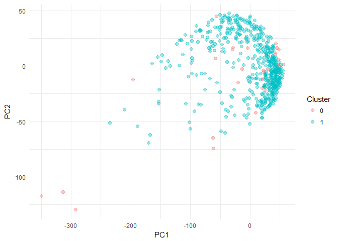<!-- -->

Again, the most obvious points classified as outliers are those closer to the lower left corner of the graph, although some of the data points within the main core cluster are also classified as anomalous when using the 95th percentile threshold

## Visualization of Outliers

We can also inspect for anomalous data with pair-wise plots:


```r
pch <- rep(".", 5)
pch[outlier] <- "+"
col <- rep("black", 5)
col[outlier] <- "red"
pairs(plotter[, 1:2],
      pch = pch,
      col = col)
```

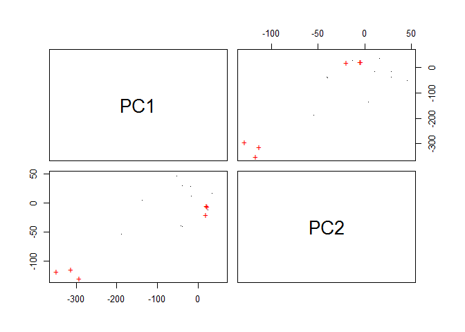<!-- -->

The results are quite similar to the ones found above. Moreover, we can show outliers by means of a biplot of the first two principal components:


```r
n <- nrow(plotter[, 1:2])
labels <- 1:n
labels[-outlier] <- "."

plotter[, 1:2] %>% 
  prcomp() %>% 
  biplot(xlabs = labels)
```

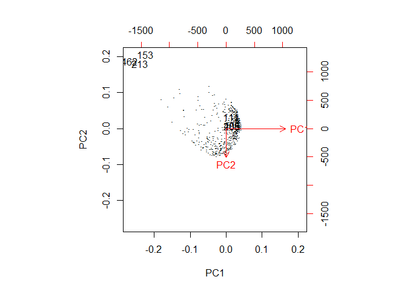<!-- -->

## LOF Scores with Parallel Computing

The ```Rlof``` package and its ```lof()``` function provide an implementation in parallel computing of the LOF algorith which supports multiple values of the *k* parameters as well as several choices of distance metrics:


```r
plotter <- data.table(pcc$x[, 1:2])
outlier_sc <- lof(plotter[, 1:2],
                  k = c(5:10))

outlier_sc %>% 
  density() %>% 
  plot()
```

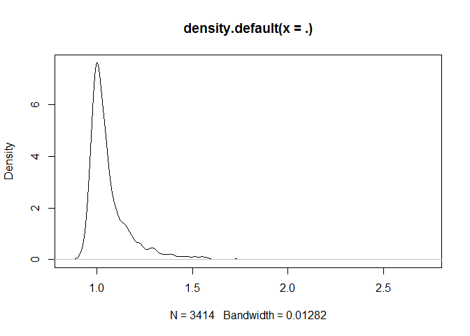<!-- -->

Again, although more faintly, the observations with anomalous density can be spotted in the long tail of the distribution.   


# References

Miro-Julia, M. *Class notes: Association rules, anomaly detection & anomalous association rules.* New Trends in Data Mining. 2017
