-   [1. Introduction](#introduction)
-   [2. Exploratory Data Analysis and Data
    Visualization](#exploratory-data-analysis-and-data-visualization)
-   [3. Correlation matrix](#correlation-matrix)
-   [4. Train & test splitting](#train-test-splitting)
-   [5. Model adjustments and plots](#model-adjustments-and-plots)
    -   [5.1. Logistic regression](#logistic-regression)
    -   [5.2. Neural Network](#neural-network)
    -   [5.3. Decision Tree](#decision-tree)
    -   [5.4. Random Forest](#random-forest)
    -   [5.5. Support Vector Machine](#support-vector-machine)
    -   [5.6. Adjustment and plots](#adjustment-and-plots)
-   [Reference](#reference)

1. Introduction
===============

Consider the "*bank-full.csv*" dataset. The data is related with direct
marketing campaigns of a Portuguese banking institution. The marketing
campaigns were based on phone calls. Often, more than one contact to the
same client was required, in order to access if the product (bank term
deposit) would be (or not) subscribed.

The dataset description can be found in the "*bank-names.txt*" file.

The motivation is to solve a classification problem using SVMs and NNs
by developing a study which contains the following:

1.  Exploratory Data Analysis and Data Visualization
2.  Correlation Matrix
3.  Train and test splitting
4.  Model adjustment and plots

Please note that I will be closely following the class notes, scripts
and documentation as well as functions and code snippets from the
lectures.

2. Exploratory Data Analysis and Data Visualization
===================================================

Let us start by loading some of the required packages. Others will be
added along the way.

    ## gridExtra  corrplot    GGally   ggplot2     e1071 tidyverse  ggthemes 
    ##      TRUE      TRUE     FALSE      TRUE      TRUE      TRUE      TRUE 
    ##  reshape2     caret     knitr 
    ##      TRUE      TRUE      TRUE

Now, we will load the bank marketing campaign data into memory to
perform extensive data manipulation:

    bank <- read.csv("./datasets/bank-full.csv",  sep = ";", na.strings = "unknown")

    dim(bank)

    ## [1] 45211    17

    str(bank)

    ## 'data.frame':    45211 obs. of  17 variables:
    ##  $ age      : int  58 44 33 47 33 35 28 42 58 43 ...
    ##  $ job      : Factor w/ 11 levels "admin.","blue-collar",..: 5 10 3 2 NA 5 5 3 6 10 ...
    ##  $ marital  : Factor w/ 3 levels "divorced","married",..: 2 3 2 2 3 2 3 1 2 3 ...
    ##  $ education: Factor w/ 3 levels "primary","secondary",..: 3 2 2 NA NA 3 3 3 1 2 ...
    ##  $ default  : Factor w/ 2 levels "no","yes": 1 1 1 1 1 1 1 2 1 1 ...
    ##  $ balance  : int  2143 29 2 1506 1 231 447 2 121 593 ...
    ##  $ housing  : Factor w/ 2 levels "no","yes": 2 2 2 2 1 2 2 2 2 2 ...
    ##  $ loan     : Factor w/ 2 levels "no","yes": 1 1 2 1 1 1 2 1 1 1 ...
    ##  $ contact  : Factor w/ 2 levels "cellular","telephone": NA NA NA NA NA NA NA NA NA NA ...
    ##  $ day      : int  5 5 5 5 5 5 5 5 5 5 ...
    ##  $ month    : Factor w/ 12 levels "apr","aug","dec",..: 9 9 9 9 9 9 9 9 9 9 ...
    ##  $ duration : int  261 151 76 92 198 139 217 380 50 55 ...
    ##  $ campaign : int  1 1 1 1 1 1 1 1 1 1 ...
    ##  $ pdays    : int  -1 -1 -1 -1 -1 -1 -1 -1 -1 -1 ...
    ##  $ previous : int  0 0 0 0 0 0 0 0 0 0 ...
    ##  $ poutcome : Factor w/ 3 levels "failure","other",..: NA NA NA NA NA NA NA NA NA NA ...
    ##  $ y        : Factor w/ 2 levels "no","yes": 1 1 1 1 1 1 1 1 1 1 ...

    summary(bank)

    ##       age                 job           marital          education    
    ##  Min.   :18.00   blue-collar:9732   divorced: 5207   primary  : 6851  
    ##  1st Qu.:33.00   management :9458   married :27214   secondary:23202  
    ##  Median :39.00   technician :7597   single  :12790   tertiary :13301  
    ##  Mean   :40.94   admin.     :5171                    NA's     : 1857  
    ##  3rd Qu.:48.00   services   :4154                                     
    ##  Max.   :95.00   (Other)    :8811                                     
    ##                  NA's       : 288                                     
    ##  default        balance       housing      loan            contact     
    ##  no :44396   Min.   : -8019   no :20081   no :37967   cellular :29285  
    ##  yes:  815   1st Qu.:    72   yes:25130   yes: 7244   telephone: 2906  
    ##              Median :   448                           NA's     :13020  
    ##              Mean   :  1362                                            
    ##              3rd Qu.:  1428                                            
    ##              Max.   :102127                                            
    ##                                                                        
    ##       day            month          duration         campaign     
    ##  Min.   : 1.00   may    :13766   Min.   :   0.0   Min.   : 1.000  
    ##  1st Qu.: 8.00   jul    : 6895   1st Qu.: 103.0   1st Qu.: 1.000  
    ##  Median :16.00   aug    : 6247   Median : 180.0   Median : 2.000  
    ##  Mean   :15.81   jun    : 5341   Mean   : 258.2   Mean   : 2.764  
    ##  3rd Qu.:21.00   nov    : 3970   3rd Qu.: 319.0   3rd Qu.: 3.000  
    ##  Max.   :31.00   apr    : 2932   Max.   :4918.0   Max.   :63.000  
    ##                  (Other): 6060                                    
    ##      pdays          previous           poutcome       y        
    ##  Min.   : -1.0   Min.   :  0.0000   failure: 4901   no :39922  
    ##  1st Qu.: -1.0   1st Qu.:  0.0000   other  : 1840   yes: 5289  
    ##  Median : -1.0   Median :  0.0000   success: 1511              
    ##  Mean   : 40.2   Mean   :  0.5803   NA's   :36959              
    ##  3rd Qu.: -1.0   3rd Qu.:  0.0000                              
    ##  Max.   :871.0   Max.   :275.0000                              
    ## 

    bank %>% 
      group_by(y) %>% 
      summarise(count = n())

    ## # A tibble: 2 x 2
    ##   y     count
    ##   <fct> <int>
    ## 1 no    39922
    ## 2 yes    5289

A quick glance at the summary of the data reveals that the positive
class accounts for 11.7% of the dataset. Let us also take a look at the
missing values of the data.

    missmap(bank,
            y.labels = NULL,
            y.at = NULL)

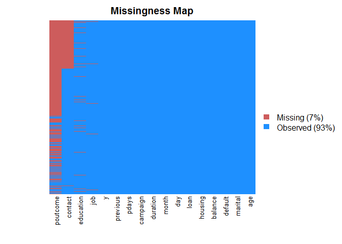

The variable `poutcome` has many missing entries, while `contact`,
`education` and `job` have fewer. Only 7% of the overall data is
missing.

It is interesting to check for skewness of numeric variables:

    skewedVars <- c()
    for(i in names(bank)){
      if(is.numeric(bank[,i])){
        skewVal <- skewness(bank[,i])
        print(paste(i, skewVal, sep = ": "))
        if(abs(skewVal) > 0.5){
          skewedVars <- c(skewedVars, i)
        }
      }
    }

    ## [1] "age: 0.684795204786645"
    ## [1] "balance: 8.36003094725269"
    ## [1] "day: 0.0930759258389723"
    ## [1] "duration: 3.14421377701039"
    ## [1] "campaign: 4.89848763841056"
    ## [1] "pdays: 2.61562868925939"
    ## [1] "previous: 41.8450660879732"

    skewedVars

    ## [1] "age"      "balance"  "duration" "campaign" "pdays"    "previous"

The variables returned by `skewedVars` are mostly skewed to the left,
with a long tail distribution as can be seen in the plots:

    lngDataYes <- 
      bank %>% 
      filter(y == 'yes') %>% 
      select_if(is.numeric) %>% 
      gather()

    lngDataNo <- 
      bank %>% 
      filter(y == 'no') %>% 
      select_if(is.numeric) %>% 
      gather()

    ggplot(data = data.frame(), aes(x = value)) +
      geom_density(data = lngDataYes, fill = '#377EB8', color = '#377EB8', alpha = .3) +
      geom_density(data = lngDataNo, fill = '#E41A1C', color = '#E41A1C', alpha = .3) +
      facet_wrap( ~ key, scales = 'free') +
      labs(title = "Density",
           subtitle = 'of each numeric variable') + 
      theme(plot.title = element_text(hjust = .5), 
            axis.ticks = element_blank(),
            panel.grid.minor.x = element_line(colour = "gray80")) + 
      scale_fill_manual(name = '',values = c(yes = '#377EB8', no = '#E41A1C')) +
      theme_fivethirtyeight()

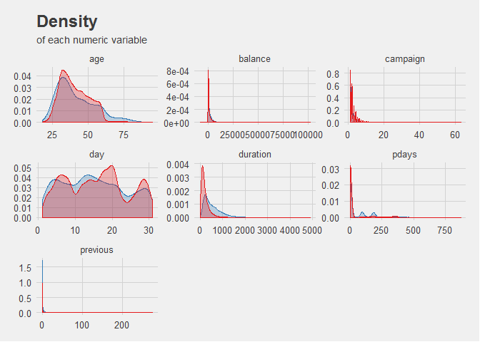

    lngDataYes <- 
      bank %>% 
      filter(y == 'yes') %>% 
      select_if(negate(is.numeric)) %>% 
      gather()

    lngDataNo <- 
      bank %>% 
      filter(y == 'no') %>% 
      select_if(negate(is.numeric)) %>% 
      gather()

    ggplot(data = data.frame(), aes(x = value)) +
      geom_bar(data = lngDataYes, fill = '#377EB8', color = '#377EB8', alpha = 1) +
      geom_bar(data = lngDataNo, fill = '#E41A1C', color = '#E41A1C', alpha = .3) +
      facet_wrap( ~ key, scales = 'free') +
      labs(title = "Distribution",
           subtitle = 'of each numeric variable') + 
      theme(plot.title = element_text(hjust = .5), 
            axis.ticks = element_blank(),
            panel.grid.minor.x = element_line(colour = "gray80")) + 
      scale_fill_manual(name = '',values = c(yes = '#377EB8', no = '#E41A1C')) +
      theme_fivethirtyeight() +
      coord_flip()

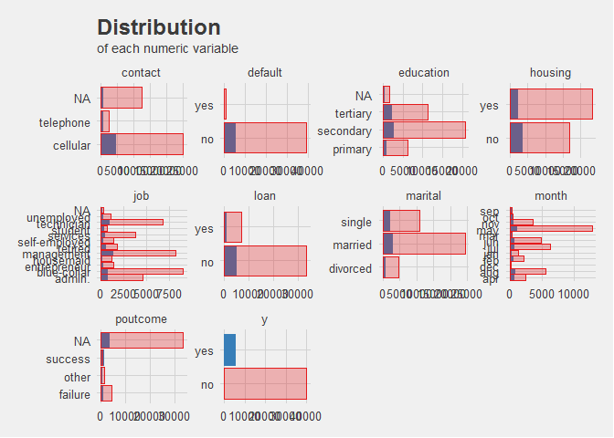

The distribution of categorical variables is also important to monitor,
since they can yield an insight on strong predictors.

    bank %>% 
      group_by(month, y) %>% 
      summarise(count = n()) %>% 
      mutate(prop = count / sum(count)) %>% 
      ggplot(aes(x = month, y = prop * 100)) +
      geom_bar(aes(fill = y), stat = 'identity', position = 'dodge', alpha = .3) +
      labs(title = "Distribution of deposits",
           subtitle = 'by campaing month') + 
      theme(plot.title = element_text(hjust = .5),
            axis.text.x = element_text(angle = 90, hjust = 1),
            axis.ticks = element_blank(),
            panel.grid.minor.x = element_line(colour = "gray80")) + 
      scale_fill_manual(name = '', values = c(yes = '#377EB8', no ='#E41A1C')) + 
      theme_fivethirtyeight()

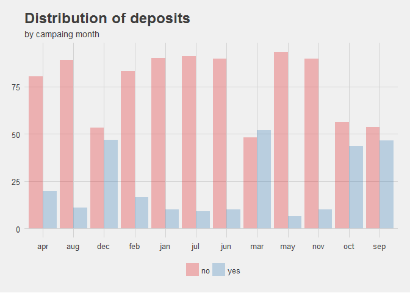

    bank %>% 
      select(month, balance, y) %>% 
      ggplot(aes(month, balance)) + 
      geom_boxplot(aes(fill = y)) + 
      coord_flip() +
      coord_cartesian(ylim = c(-3000, 11000)) +
      xlab('Campaign month') +
      labs(title = "Distribution of deposits",
           subtitle = 'by campaing month') + 
      theme(plot.title = element_text(hjust = .5),
            axis.text.x = element_text(angle = 90, hjust = 1),
            axis.ticks = element_blank(),
            panel.grid.minor.x = element_line(colour = "gray80")) + 
      scale_fill_manual(name = '', values = c(yes = '#377EB8', no ='#E41A1C')) + 
      theme_fivethirtyeight()

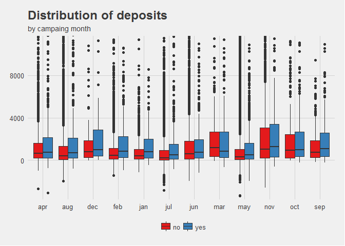

For instance, it can be seen that the `month` variable can be useful
since some months such as March have a better yield of succesful
subscriptions. However, many data points are considered outliers and lie
beyond the 1st and 3rd quarters of the distribution.

    bank %>% 
      select_if(negate(is.numeric)) %>% 
      ggplot() +
      geom_bar(aes(x = default, y = log(..count..), fill = y)) + 
      facet_grid(housing ~ loan, scales = 'free') +
      coord_flip() +
      labs(title = "Proportion of accounts in default",
           subtitle = 'housing loans vs personal loans') + 
      theme(plot.title = element_text(hjust = .5), 
            panel.grid.minor.x = element_line(colour = "gray80"),
            strip.text.y = element_blank()) + 
      scale_fill_manual(name = '',
                        values = c(yes = '#377EB8', no ='#E41A1C')) + 
      theme_fivethirtyeight()

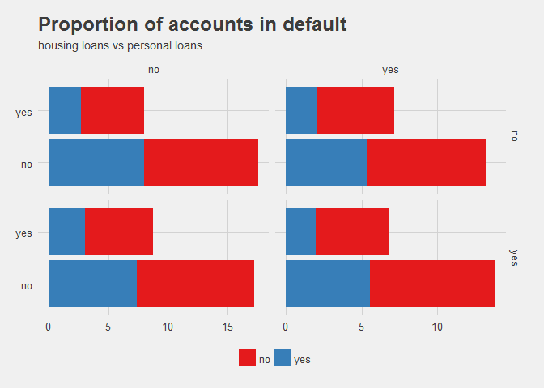

The graph above, plotted on a logarithmic scale for display purposes,
show the proportion of contracted deposits for different values of the
variables `housing` (on the Y-axis) and `loan` (on the X-axis). Blue
values represent clients in a `default` status. A hidden insight within
the data reveals that, as it would be expected, people in default would
not want to subscribe to additional products, especially when they have
also contracted a personal or housing loan.

    bank %>% 
      ggplot(aes(x = campaign, y = duration, color = y)) +
      geom_jitter(stat = "identity") + 
      labs(title = "Number of campaign calls and duration",
           subtitle = "by subscription status") + 
      theme(plot.title = element_text(hjust = .5), 
            axis.ticks = element_blank(),
            panel.grid.minor.x = element_line(colour = "gray80")) + 
      scale_color_manual(name = '', values = c(yes = '#377EB8', no ='#E41A1C')) + 
      theme_fivethirtyeight() +
      geom_hline(aes(yintercept = 200), lty = 'dashed') +
      coord_cartesian(xlim = c(0, 40))

It is also very interesting that very few values in the scatter plot
above lie below the 200 seconds value on the `duration` variable, as
denoted by the dashed line. Therefore it appears that fewer and longer
calls are more effective at getting clients to subscribe a deposit.

Let us confirm this assertion by plotting subscription rates along the
number of calls made to the same client:

    bank %>% 
      ggplot(aes(x = campaign, fill = y)) +
      geom_histogram(position = 'dodge') + 
      labs(title = "Number of subscriptions",
           subtitle = "by number of calls") + 
      theme(plot.title = element_text(hjust = .5), 
            axis.ticks = element_blank(),
            panel.grid.minor.x = element_line(colour = "gray80")) + 
      scale_fill_manual(name = '', values = c(yes = '#377EB8', no ='#E41A1C')) + 
      theme_fivethirtyeight() +
      coord_cartesian(xlim = c(0, 20))

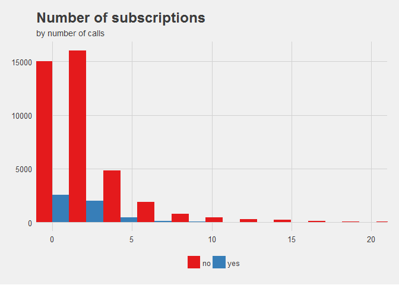

As expected, the fewer calls performed on the same client, the higher
the probability to subscribe.

    bank %>% 
      ggplot(aes(x = age)) +
      geom_density(aes(x = age, fill = y), alpha = .6) +
      labs(title = "Distribution of deposits",
           subtitle = 'by age of client') + 
      theme(plot.title = element_text(hjust = .5),
            axis.text.x = element_text(angle = 90, hjust = 1),
            axis.ticks = element_blank(),
            panel.grid.minor.x = element_line(colour = "gray80")) + 
      scale_fill_manual(name = '', values = c(yes = '#377EB8', no ='#E41A1C')) + 
      theme_fivethirtyeight()

The `age` density plot reveals that better adoption rates are found
within the extreme groups of the population. That is, the young and
especially the elderly. This may also be correlated with the job
category of a client, which can be easily checked:

    bank %>% 
      group_by(y, job) %>% 
      summarise(count = n()) %>% 
      arrange(count) %>% 
      mutate(freq = count / sum(count)) %>%
      ggplot(aes(x = reorder(job, -freq), y = freq, fill = y)) +
      geom_bar(stat = "identity", width = .5) + coord_flip() + 
      labs(title = "Distribution of deposits",
           subtitle = 'individual proportion over jobs') + 
      theme(plot.title = element_text(hjust = .5), 
            axis.ticks = element_blank(),
            panel.grid.minor.x = element_line(colour = "gray80")) + 
      scale_fill_manual(name = '', values = c(yes = '#377EB8', no ='#E41A1C')) + 
      theme_fivethirtyeight()

It can be seen that students and retired clients are more likely to
purchase a subscription, which correlates nicely with our previous
hypothesis.

    bank %>% 
      ggplot(aes(x = balance)) +
      geom_density(aes(fill = y), alpha = 0.6) + 
      labs(title = "Balance density",
           subtitle = 'analyzed over the full dataset') + 
      theme(plot.title = element_text(hjust = .5), 
            axis.ticks = element_blank(),
            panel.grid.minor.x = element_line(colour = "gray80")) + 
      scale_fill_manual(name = '', values = c(yes = '#377EB8', no ='#E41A1C')) + 
      theme_fivethirtyeight() +
      coord_cartesian(xlim = c(0, 15000))

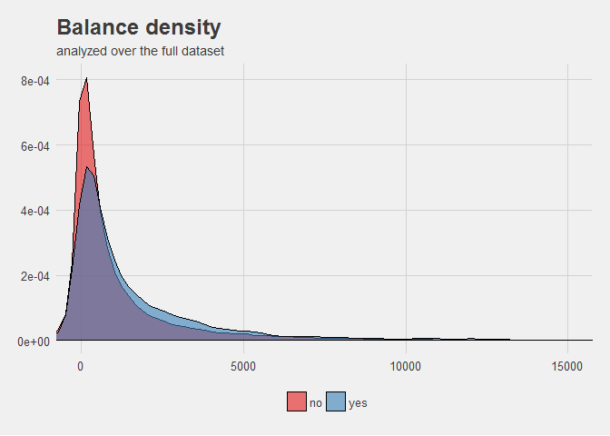

3. Correlation matrix
=====================

    correlations <- bank %>%
                    select_if(is.numeric) %>% 
                    na.omit() %>% 
                    cor()

    as.data.frame(correlations) %>% round(4) %>% knitr::kable()

<table>
<thead>
<tr class="header">
<th></th>
<th align="right">age</th>
<th align="right">balance</th>
<th align="right">day</th>
<th align="right">duration</th>
<th align="right">campaign</th>
<th align="right">pdays</th>
<th align="right">previous</th>
</tr>
</thead>
<tbody>
<tr class="odd">
<td>age</td>
<td align="right">1.0000</td>
<td align="right">0.0978</td>
<td align="right">-0.0091</td>
<td align="right">-0.0046</td>
<td align="right">0.0048</td>
<td align="right">-0.0238</td>
<td align="right">0.0013</td>
</tr>
<tr class="even">
<td>balance</td>
<td align="right">0.0978</td>
<td align="right">1.0000</td>
<td align="right">0.0045</td>
<td align="right">0.0216</td>
<td align="right">-0.0146</td>
<td align="right">0.0034</td>
<td align="right">0.0167</td>
</tr>
<tr class="odd">
<td>day</td>
<td align="right">-0.0091</td>
<td align="right">0.0045</td>
<td align="right">1.0000</td>
<td align="right">-0.0302</td>
<td align="right">0.1625</td>
<td align="right">-0.0930</td>
<td align="right">-0.0517</td>
</tr>
<tr class="even">
<td>duration</td>
<td align="right">-0.0046</td>
<td align="right">0.0216</td>
<td align="right">-0.0302</td>
<td align="right">1.0000</td>
<td align="right">-0.0846</td>
<td align="right">-0.0016</td>
<td align="right">0.0012</td>
</tr>
<tr class="odd">
<td>campaign</td>
<td align="right">0.0048</td>
<td align="right">-0.0146</td>
<td align="right">0.1625</td>
<td align="right">-0.0846</td>
<td align="right">1.0000</td>
<td align="right">-0.0886</td>
<td align="right">-0.0329</td>
</tr>
<tr class="even">
<td>pdays</td>
<td align="right">-0.0238</td>
<td align="right">0.0034</td>
<td align="right">-0.0930</td>
<td align="right">-0.0016</td>
<td align="right">-0.0886</td>
<td align="right">1.0000</td>
<td align="right">0.4548</td>
</tr>
<tr class="odd">
<td>previous</td>
<td align="right">0.0013</td>
<td align="right">0.0167</td>
<td align="right">-0.0517</td>
<td align="right">0.0012</td>
<td align="right">-0.0329</td>
<td align="right">0.4548</td>
<td align="right">1.0000</td>
</tr>
</tbody>
</table>

    corrplot(correlations, method = "square")

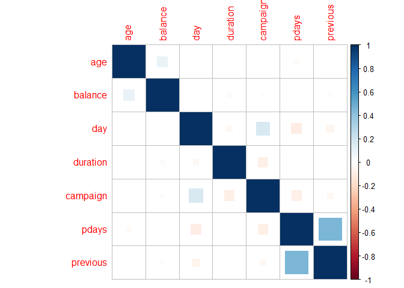

The numerical variables have low correlation values between one another.
No further steps are needed to remove any highly correlated features.

4. Train & test splitting
=========================

Instead of using the `caret` package, the code snippet below quickly
splits the data in equally proportioned sets:

    bank <- na.omit(bank)
    index <- 1:nrow(bank)
    test_idx <- sample(index, trunc(length(index) * 30 / 100))
    test_set <- bank[test_idx,]
    train_set <- bank[-test_idx,]

    table(train_set$y) / length(train_set$y)

    ## 
    ##       no      yes 
    ## 0.771949 0.228051

    table(test_set$y) / length(test_set$y)

    ## 
    ##        no       yes 
    ## 0.7729592 0.2270408

5. Model adjustments and plots
==============================

Fitting several different models will allow us to carefully compare
their performances and accuracy:

5.1. Logistic regression
------------------------

    log_mdl <- glm(y ~ .,
                   data = train_set,
                   family = binomial('logit'))
    summary(log_mdl)

    ## 
    ## Call:
    ## glm(formula = y ~ ., family = binomial("logit"), data = train_set)
    ## 
    ## Deviance Residuals: 
    ##     Min       1Q   Median       3Q      Max  
    ## -3.5301  -0.4673  -0.2921  -0.1654   2.8845  
    ## 
    ## Coefficients:
    ##                      Estimate Std. Error z value Pr(>|z|)    
    ## (Intercept)        -3.688e+00  4.061e-01  -9.082  < 2e-16 ***
    ## age                 5.997e-04  5.239e-03   0.114 0.908864    
    ## jobblue-collar     -3.493e-01  1.701e-01  -2.053 0.040056 *  
    ## jobentrepreneur    -7.980e-01  3.467e-01  -2.302 0.021360 *  
    ## jobhousemaid       -1.960e-01  3.171e-01  -0.618 0.536454    
    ## jobmanagement      -1.348e-01  1.614e-01  -0.835 0.403699    
    ## jobretired         -2.913e-03  2.285e-01  -0.013 0.989827    
    ## jobself-employed   -2.963e-01  2.579e-01  -1.149 0.250465    
    ## jobservices        -8.501e-02  1.914e-01  -0.444 0.656930    
    ## jobstudent          3.491e-01  2.320e-01   1.505 0.132327    
    ## jobtechnician      -1.314e-01  1.519e-01  -0.865 0.387000    
    ## jobunemployed       3.354e-02  2.643e-01   0.127 0.899017    
    ## maritalmarried      1.157e-01  1.422e-01   0.814 0.415761    
    ## maritalsingle       7.320e-02  1.635e-01   0.448 0.654310    
    ## educationsecondary  2.614e-01  1.579e-01   1.656 0.097734 .  
    ## educationtertiary   5.069e-01  1.822e-01   2.782 0.005400 ** 
    ## defaultyes         -2.091e+00  1.105e+00  -1.892 0.058537 .  
    ## balance             1.744e-05  1.199e-05   1.455 0.145698    
    ## housingyes         -7.998e-01  9.910e-02  -8.071 6.97e-16 ***
    ## loanyes            -4.181e-01  1.474e-01  -2.836 0.004567 ** 
    ## contacttelephone   -3.036e-01  1.733e-01  -1.752 0.079774 .  
    ## day                 2.498e-02  5.848e-03   4.271 1.94e-05 ***
    ## monthaug            1.068e+00  1.838e-01   5.812 6.17e-09 ***
    ## monthdec            8.405e-01  2.989e-01   2.813 0.004916 ** 
    ## monthfeb            5.393e-01  1.891e-01   2.851 0.004357 ** 
    ## monthjan           -7.883e-01  2.531e-01  -3.114 0.001846 ** 
    ## monthjul            1.171e+00  2.345e-01   4.994 5.92e-07 ***
    ## monthjun            1.326e+00  2.136e-01   6.208 5.36e-10 ***
    ## monthmar            1.421e+00  2.685e-01   5.295 1.19e-07 ***
    ## monthmay            1.278e-02  1.519e-01   0.084 0.932955    
    ## monthnov           -3.550e-02  1.773e-01  -0.200 0.841299    
    ## monthoct            1.084e+00  2.046e-01   5.301 1.15e-07 ***
    ## monthsep            1.351e+00  2.206e-01   6.124 9.13e-10 ***
    ## duration            3.960e-03  1.874e-04  21.131  < 2e-16 ***
    ## campaign           -1.099e-01  3.295e-02  -3.336 0.000849 ***
    ## pdays               7.343e-04  3.974e-04   1.848 0.064629 .  
    ## previous            4.024e-02  1.198e-02   3.359 0.000783 ***
    ## poutcomeother       1.508e-01  1.121e-01   1.346 0.178404    
    ## poutcomesuccess     2.134e+00  1.011e-01  21.107  < 2e-16 ***
    ## ---
    ## Signif. codes:  0 '***' 0.001 '**' 0.01 '*' 0.05 '.' 0.1 ' ' 1
    ## 
    ## (Dispersion parameter for binomial family taken to be 1)
    ## 
    ##     Null deviance: 5895.3  on 5489  degrees of freedom
    ## Residual deviance: 3747.7  on 5451  degrees of freedom
    ## AIC: 3825.7
    ## 
    ## Number of Fisher Scoring iterations: 6

    prob <- predict(log_mdl,
                    test_set,
                    type = 'response')
    pred <- rep('no', length(prob))
    pred[prob >= .5] <- 'yes'
     
    confusionMatrix(pred, test_set$y)

    ## Confusion Matrix and Statistics
    ## 
    ##           Reference
    ## Prediction   no  yes
    ##        no  1688  254
    ##        yes  130  280
    ##                                           
    ##                Accuracy : 0.8367          
    ##                  95% CI : (0.8212, 0.8515)
    ##     No Information Rate : 0.773           
    ##     P-Value [Acc > NIR] : 1.117e-14       
    ##                                           
    ##                   Kappa : 0.4933          
    ##  Mcnemar's Test P-Value : 3.456e-10       
    ##                                           
    ##             Sensitivity : 0.9285          
    ##             Specificity : 0.5243          
    ##          Pos Pred Value : 0.8692          
    ##          Neg Pred Value : 0.6829          
    ##              Prevalence : 0.7730          
    ##          Detection Rate : 0.7177          
    ##    Detection Prevalence : 0.8257          
    ##       Balanced Accuracy : 0.7264          
    ##                                           
    ##        'Positive' Class : no              
    ## 

5.2. Neural Network
-------------------

Let us fit a neural network with random structure and see the general
performance of the technique. Afterwards, we can try to tune it further.

    nn_pred <- predict(nn_mdl2,
                       newdata = test_set,
                       type = 'raw')

    nn_pred_prob <- rep('no', length(nn_pred))
    nn_pred_prob[nn_pred >= 0.5] <- 'yes'

    confusionMatrix(nn_pred_prob, test_set$y)

    ## Confusion Matrix and Statistics
    ## 
    ##           Reference
    ## Prediction   no  yes
    ##        no  1643  225
    ##        yes  175  309
    ##                                           
    ##                Accuracy : 0.8299          
    ##                  95% CI : (0.8141, 0.8449)
    ##     No Information Rate : 0.773           
    ##     P-Value [Acc > NIR] : 5.699e-12       
    ##                                           
    ##                   Kappa : 0.4989          
    ##  Mcnemar's Test P-Value : 0.01429         
    ##                                           
    ##             Sensitivity : 0.9037          
    ##             Specificity : 0.5787          
    ##          Pos Pred Value : 0.8796          
    ##          Neg Pred Value : 0.6384          
    ##              Prevalence : 0.7730          
    ##          Detection Rate : 0.6986          
    ##    Detection Prevalence : 0.7942          
    ##       Balanced Accuracy : 0.7412          
    ##                                           
    ##        'Positive' Class : no              
    ## 

    nn_pred <- predict(nn_mdl,
                       newdata = test_set,
                       type = 'raw') %>% 
      round()

    confusionMatrix(nn_pred, as.numeric(test_set$y) - 1)

    ## Confusion Matrix and Statistics
    ## 
    ##           Reference
    ## Prediction    0    1
    ##          0 1636  191
    ##          1  182  343
    ##                                         
    ##                Accuracy : 0.8414        
    ##                  95% CI : (0.826, 0.856)
    ##     No Information Rate : 0.773         
    ##     P-Value [Acc > NIR] : <2e-16        
    ##                                         
    ##                   Kappa : 0.5455        
    ##  Mcnemar's Test P-Value : 0.6787        
    ##                                         
    ##             Sensitivity : 0.8999        
    ##             Specificity : 0.6423        
    ##          Pos Pred Value : 0.8955        
    ##          Neg Pred Value : 0.6533        
    ##              Prevalence : 0.7730        
    ##          Detection Rate : 0.6956        
    ##    Detection Prevalence : 0.7768        
    ##       Balanced Accuracy : 0.7711        
    ##                                         
    ##        'Positive' Class : 0             
    ## 

There is a small improvement in the accuracy of the model, from 82% to
83%, derived from the increase in neurons. We will keep the better model
for future comparison.

5.3. Decision Tree
------------------

A classification tree can also help predict variable classes:

    tree_model <- rpart(y ~ .,
                        data = train_set,
                        method = "class",
                        minbucket = 20)

    tree_predict <- predict(tree_model,
                            test_set,
                            type = "class")

    tree_pred_prob <- predict(tree_model,
                            test_set,
                            type = "prob")

    confusionMatrix(test_set$y, tree_predict)

    ## Confusion Matrix and Statistics
    ## 
    ##           Reference
    ## Prediction   no  yes
    ##        no  1696  122
    ##        yes  253  281
    ##                                           
    ##                Accuracy : 0.8406          
    ##                  95% CI : (0.8251, 0.8551)
    ##     No Information Rate : 0.8287          
    ##     P-Value [Acc > NIR] : 0.06517         
    ##                                           
    ##                   Kappa : 0.5027          
    ##  Mcnemar's Test P-Value : 1.904e-11       
    ##                                           
    ##             Sensitivity : 0.8702          
    ##             Specificity : 0.6973          
    ##          Pos Pred Value : 0.9329          
    ##          Neg Pred Value : 0.5262          
    ##              Prevalence : 0.8287          
    ##          Detection Rate : 0.7211          
    ##    Detection Prevalence : 0.7730          
    ##       Balanced Accuracy : 0.7837          
    ##                                           
    ##        'Positive' Class : no              
    ## 

5.4. Random Forest
------------------

Also, we can use an ensemble model of decision trees to create a random
forest:

    rf <- randomForest(y ~ .,
                       data = train_set,
                       ntree = 1000)
    rf_pred_prob <- predict(rf,
                            newdata = test_set,
                            type = 'prob')
    rf_pred <- predict(rf,
                       newdata = test_set,
                       type = 'class')

    confusionMatrix(test_set$y, rf_pred)

    ## Confusion Matrix and Statistics
    ## 
    ##           Reference
    ## Prediction   no  yes
    ##        no  1674  144
    ##        yes  187  347
    ##                                           
    ##                Accuracy : 0.8593          
    ##                  95% CI : (0.8446, 0.8731)
    ##     No Information Rate : 0.7912          
    ##     P-Value [Acc > NIR] : < 2e-16         
    ##                                           
    ##                   Kappa : 0.5873          
    ##  Mcnemar's Test P-Value : 0.02097         
    ##                                           
    ##             Sensitivity : 0.8995          
    ##             Specificity : 0.7067          
    ##          Pos Pred Value : 0.9208          
    ##          Neg Pred Value : 0.6498          
    ##              Prevalence : 0.7912          
    ##          Detection Rate : 0.7117          
    ##    Detection Prevalence : 0.7730          
    ##       Balanced Accuracy : 0.8031          
    ##                                           
    ##        'Positive' Class : no              
    ## 

5.5. Support Vector Machine
---------------------------

An SVM model can greatly outperform all others. Let us see how it can
perform:

    svm_model <- svm(y ~ ., data = train_set, kernel = "radial")

    summary(svm_model)

    ## 
    ## Call:
    ## svm(formula = y ~ ., data = train_set, kernel = "radial")
    ## 
    ## 
    ## Parameters:
    ##    SVM-Type:  C-classification 
    ##  SVM-Kernel:  radial 
    ##        cost:  1 
    ##       gamma:  0.02564103 
    ## 
    ## Number of Support Vectors:  2077
    ## 
    ##  ( 1055 1022 )
    ## 
    ## 
    ## Number of Classes:  2 
    ## 
    ## Levels: 
    ##  no yes

    prediction <- predict(svm_model, test_set[,-17])

    table(pred = prediction,
          y = test_set$y) / length(prediction)

    ##      y
    ## pred          no        yes
    ##   no  0.70960884 0.10629252
    ##   yes 0.06335034 0.12074830

    table(pred = prediction,
          y = test_set[,17])

    ##      y
    ## pred    no  yes
    ##   no  1669  250
    ##   yes  149  284

    cm_svm <- confusionMatrix(prediction, test_set$y)

An accuracy of 83.04% is acceptable, but previous models already
outperform this one. Notice that the overall accuracy might not be the
best metric to analyze this models' performances. However, this will be
addressed later on. We can use cross validation techniques or fine-tune
the model's parameters to obtain better results:

    set.seed(6)

    control <- trainControl(method = "cv", number = 10)

    cv_svm <- train(y ~ .,
                    data = train_set,
                    method = "svmLinear",
                    metric = "Accuracy",
                    trControl = control)

    cv_pred_prob <- predict(cv_svm,
                            newdata = test_set,
                            type = 'raw')

    (cm_cv_svm <- confusionMatrix(cv_pred_prob, test_set$y))

    ## Confusion Matrix and Statistics
    ## 
    ##           Reference
    ## Prediction   no  yes
    ##        no  1659  258
    ##        yes  159  276
    ##                                           
    ##                Accuracy : 0.8227          
    ##                  95% CI : (0.8067, 0.8379)
    ##     No Information Rate : 0.773           
    ##     P-Value [Acc > NIR] : 1.873e-09       
    ##                                           
    ##                   Kappa : 0.4595          
    ##  Mcnemar's Test P-Value : 1.594e-06       
    ##                                           
    ##             Sensitivity : 0.9125          
    ##             Specificity : 0.5169          
    ##          Pos Pred Value : 0.8654          
    ##          Neg Pred Value : 0.6345          
    ##              Prevalence : 0.7730          
    ##          Detection Rate : 0.7054          
    ##    Detection Prevalence : 0.8151          
    ##       Balanced Accuracy : 0.7147          
    ##                                           
    ##        'Positive' Class : no              
    ## 

82.27% accuracy is also good, but still not optimal. The cross validated
SVM can still be improved upon.

Using the `total_accuracy_svm` function from the lectures, we can try to
find the best values for the C and Gamma parameters:

    gamma <- c(10 ^ seq(-5, -1,
                        by = 1))

    cost <- c(10 ^ seq(-2, 1,
                       by = 1))

    params <- expand.grid(cost = cost,
                          gamma = gamma)

    total_accuracy_svm <- function(train_set, test_set) {
      accuracy1 <- NULL
      accuracy2 <- NULL
      for (i in 1:nrow(params)) {
        learn_svm <-
          svm(
            y ~ .,
            data = train_set,
            gamma = params$gamma[i],
            cost = params$cost[i],
            kernel = 'radial'
          )
        pred_svm <- predict(learn_svm, test_set[, -17])
        accuracy1 <- confusionMatrix(pred_svm, test_set$y)
        accuracy2[i] <- accuracy1$overall[1]
      }
      accuracy2
    }

    c <- total_accuracy_svm(train_set, test_set)
    opt_params <- which(c == max(c))[1]

    opt_cost = params$cost[opt_params]
    opt_gamma = params$gamma[opt_params]

The optimal values obtained are `cost` = 1 and `gamma` = 0.1, which can
be used to train the final SVM:

    imp_svm <-
      svm(y ~ .,
          data = train_set,
          cost = opt_cost,
          gamma = opt_gamma)

    pred_imp_svm <- predict(imp_svm, test_set[, -17])
    (cm_imp_svm <- confusionMatrix(pred_imp_svm, test_set$y))

    ## Confusion Matrix and Statistics
    ## 
    ##           Reference
    ## Prediction   no  yes
    ##        no  1679  230
    ##        yes  139  304
    ##                                           
    ##                Accuracy : 0.8431          
    ##                  95% CI : (0.8278, 0.8576)
    ##     No Information Rate : 0.773           
    ##     P-Value [Acc > NIR] : < 2.2e-16       
    ##                                           
    ##                   Kappa : 0.5244          
    ##  Mcnemar's Test P-Value : 2.797e-06       
    ##                                           
    ##             Sensitivity : 0.9235          
    ##             Specificity : 0.5693          
    ##          Pos Pred Value : 0.8795          
    ##          Neg Pred Value : 0.6862          
    ##              Prevalence : 0.7730          
    ##          Detection Rate : 0.7139          
    ##    Detection Prevalence : 0.8116          
    ##       Balanced Accuracy : 0.7464          
    ##                                           
    ##        'Positive' Class : no              
    ## 

With 84.31% accuracy, this is the best model obtained so far. Let us get
the SVM and prediction objects ready for posterior manipulation:

    mdl_svm <- 
      ksvm(y ~ .,
           data = train_set,
           kernel = "rbfdot")

    imp_svm <-
      ksvm(y ~ .,
           data = train_set,
           cost = opt_cost,
           gamma = opt_gamma,
           kernel = "rbfdot")

    svm_pred_prob <- predict(mdl_svm,
                             newdata = test_set,
                             type = 'decision')
    imp_pred_prob <- predict(imp_svm,
                             newdata = test_set,
                             type = 'decision')

5.6. Adjustment and plots
-------------------------

We can plot the prediction values of the SVM models as seen in the
lectures:

    colr <- c("#ed3b3b", "#0099ff")
    par(mfrow = c(1, 2))

    fourfoldplot(cm_cv_svm$table,
                 color = colr,
                 conf.level = 0, 
                 margin = 1,
                 main = paste("CV SVM (", round(cm_cv_svm$overall[1] * 100), "%)",sep = ""))

    fourfoldplot(cm_imp_svm$table, 
                 color = colr,
                 conf.level = 0, 
                 margin = 1,
                 main = paste("Tuned SVM (", round(cm_imp_svm$overall[1] * 100), "%)",sep = ""))

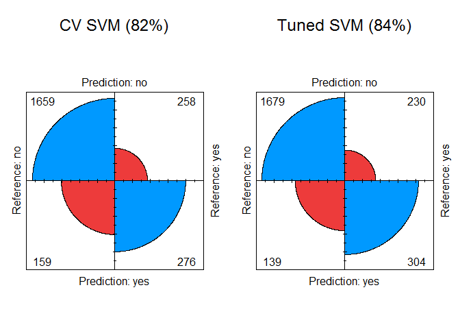

As well as the Principal Component projections that allow us to view the
decision boundary:

    my_data <- select_if(bank, is.numeric)
    res.pca <- prcomp(my_data, scale = TRUE)

    fviz_pca_biplot(res.pca,
      col.ind = bank$y,
      col = "black",
      palette = "jco",
      geom = "point",
      repel = TRUE,
      legend.title = "Charges",
      addEllipses = TRUE,
      ylim = c(5, -15)
    )

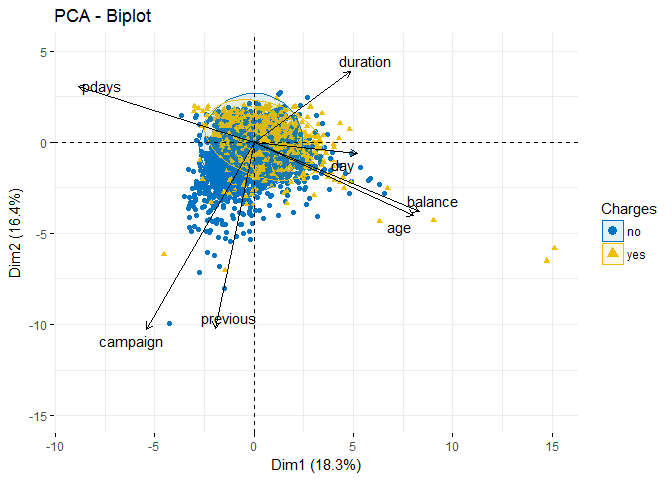

In order to deal with the unreliability of the overall accuracy metric,
we will follow the class notes to display Receiver Operating
Characteristic curves of the models, as well as the Area Under the
Curve.

For that, we create `prediction` objects and store True and False
positives in a data frame:

    pr <- ROCR::prediction(prob, test_set$y)
    prf <- performance(pr, measure = "tpr", x.measure = "fpr")
    dd <- data.frame(FP = prf@x.values[[1]], TP = prf@y.values[[1]])

    pr1 <- ROCR::prediction(nn_pred, test_set$y)
    prf1 <- performance(pr1, measure = "tpr", x.measure = "fpr")
    dd1 <- data.frame(FP = prf1@x.values[[1]], TP = prf1@y.values[[1]])

    pr2 <- ROCR::prediction(tree_pred_prob[,2], test_set$y)
    prf2 <- performance(pr2, measure = "tpr", x.measure = "fpr")
    dd2 <- data.frame(FP = prf2@x.values[[1]], TP = prf2@y.values[[1]])

    pr3 <- ROCR::prediction(rf_pred_prob[,2], test_set$y)
    prf3 <- performance(pr3, measure = "tpr", x.measure = "fpr")
    dd3 <- data.frame(FP = prf3@x.values[[1]], TP = prf3@y.values[[1]])

    pr4 <- ROCR::prediction(svm_pred_prob, test_set$y)
    prf4 <- performance(pr4, measure = "tpr", x.measure = "fpr")
    dd4 <- data.frame(FP = prf4@x.values[[1]], TP = prf4@y.values[[1]])

    pr5 <- ROCR::prediction(imp_pred_prob, test_set$y)
    prf5 <- performance(pr5, measure = "tpr", x.measure = "fpr")
    dd5 <- data.frame(FP = prf5@x.values[[1]], TP = prf5@y.values[[1]])

Next, we can plot the curves using this dataframe:

    g <- ggplot() + 
      geom_line(data = dd, aes(x = FP, y = TP, color = 'Logistic Regression'), size = 1.25) + 
      geom_line(data = dd1, aes(x = FP, y = TP, color = 'Neural Network'), size = 1.25) + 
      geom_line(data = dd2, aes(x = FP, y = TP, color = 'Decision Tree'), size = 1.25) + 
      geom_line(data = dd3, aes(x = FP, y = TP, color = 'Random Forest'), size = 1.25) +
      geom_line(data = dd4, aes(x = FP, y = TP, color = 'CV Support Vector Machine'), size = 1.25) +
      geom_line(data = dd5, aes(x = FP, y = TP, color = 'Tuned Support Vector Machine'), size = 1.25) +
      geom_segment(aes(x = 0, xend = 1, y = 0, yend = 1)) +
      ggtitle('ROC Curve') + 
      labs(x = 'False Positive Rate', y = 'True Positive Rate') +  theme(legend.position = "bottom") + 
      theme(plot.title = element_text(hjust = .5), 
            axis.ticks = element_blank(),
            panel.grid.minor.x = element_line(colour = "gray80")) + 
      scale_fill_manual(name = '', values = c(yes = '#377EB8', no ='#E41A1C')) + 
      theme_fivethirtyeight()

    g +  scale_colour_manual(name = 'Classifier', values = c('Logistic Regression'='#E69F00',
                                                             'Neural Network'='#56B4E9', 'Decision Tree'='#009E73',
                                                             'Random Forest'='#D55E00', 'CV Support Vector Machine'='#0072B2', 'Tuned Support Vector Machine'='#0352B1'))

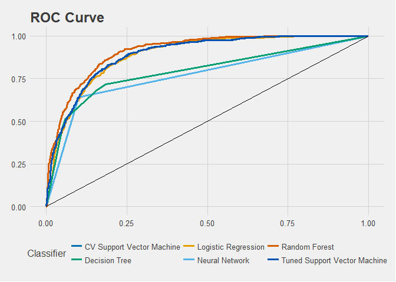

And compute the AUC metric:

    auc <- rbind(performance(pr, measure = 'auc')@y.values[[1]],
                 performance(pr1, measure = 'auc')@y.values[[1]],
                 performance(pr2, measure = 'auc')@y.values[[1]],
                 performance(pr3, measure = 'auc')@y.values[[1]],
                 performance(pr4, measure = 'auc')@y.values[[1]],
                 performance(pr5, measure = 'auc')@y.values[[1]])

    colnames(auc) <- 'AUC'

    auc <- auc %>%
      as.data.frame() %>%
      arrange(AUC) %>%
      round(4)

    rownames(auc) <- (c('Logistic Regression', 'Neural Network', 'Decision Tree',
                        'Random Forest', 'CV Support Vector Machine',
                        'Tuned Support Vector Machine'))
    auc

    ##                                 AUC
    ## Logistic Regression          0.7711
    ## Neural Network               0.7943
    ## Decision Tree                0.8895
    ## Random Forest                0.8928
    ## CV Support Vector Machine    0.8929
    ## Tuned Support Vector Machine 0.9121

As expected, the Tuned SVM yields the best possible results from within
all the applied models, with the highest Area Under the Curve.
Nonetheless, it takes considerably longer to train than other models.
This is due to the fact that there are actually several models trained,
one for every combination of `cost` and `gamma` defined. Then, we find
the one with higher accuracy and train the final model with the optimal
parameters found in the step above.

Reference
=========

S. Moro, R. Laureano and P. Cortez. *Using Data Mining for Bank Direct
Marketing: An Application of the CRISP-DM Methodology.* 2011

Gonzalez-Hidalgo, M., Miro-Julia, M. *Class notes.* Statistical Learning
and Decision Making II. 2018.
